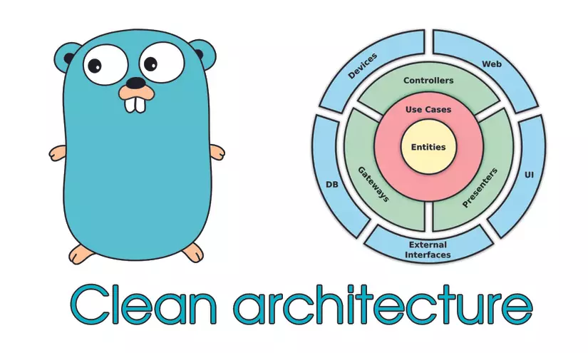

# A Simple Clean Architecture Implementation In Golang



### I. Tech stack:

-   Gin
-   GORM
-   Postgres
-   JWT
-   Docker

### II. Swagger

#### 1. Install Swag

```python
    go install github.com/swaggo/swag/cmd/swag@latest
```

#### 2. Init swagger

```python
    swag init -g cmd/main.go
```

### III. Prepare database

#### 1. Create postgres database using Docker

```python
    make init_db
```

#### 2. Remove database

```python
    make  rm_db
```

### IV. Run application

#### 1. Run with migration database

```python
    make local m=true
```

#### 2. Run without migration database

```python
    make local m=false
```

### V. Run with Docker

#### 1. Compose up

```python
    make compose_up
```

#### 2. Compose down

```python
    make compose_down
```
