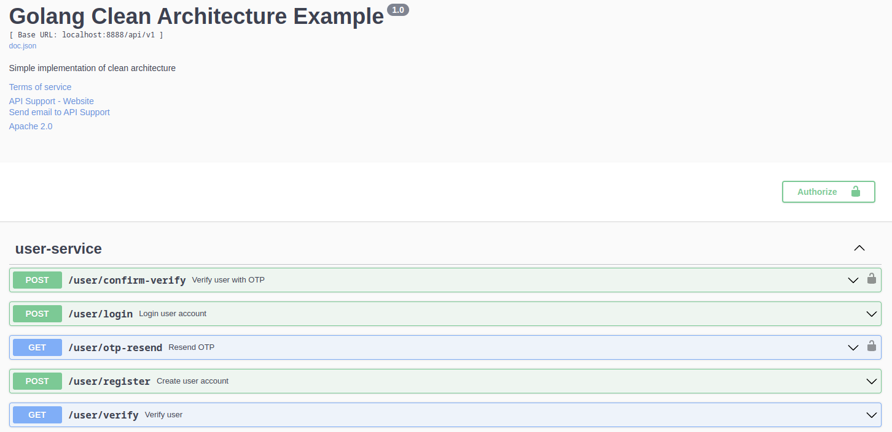

# A Simple Clean Architecture Implementation In Golang

> <p style='text-align: justify;'> 
> Clean Architecture is a software architectural pattern designed to create scalable, maintainable, and testable applications using the Go programming language. It enforces a clear separation of concerns, making it easier to develop and maintain complex software systems.

</p>


### What I have done in this sample project?

-   [x] A sample user module with 5 apis
-   [x] Send template mail using SMTP
-   [x] Dockerizing project by dockerfile and docker-compose
-   [x] Swagger API docs
-   [x] Unit test
-   [x] Integration tests for each use case

### I. Tech stack:

-   Gin
-   GORM
-   Postgres
-   JWT
-   Docker

### II. API documentation with Swagger



#### 1. Install Swaggo

```python
    go install github.com/swaggo/swag/cmd/swag@latest
```

#### 2. Init swag to generate docs

```python
    swag init -g cmd/main.go
```

-   When you have successfully initiated the server, you can access the API documentation by visiting http://localhost:8888/docs/index.html.

### III. Prepare database

#### 1. Create postgres database using Docker

```python
    make init_db
```

#### 2. Remove database

```python
    make  rm_db
```

### IV. Run application

-   Remember to download all dependencies before you start server

```python
    go mod download
```

```python
    go mod tidy
```

-   Then you need to config your SMPT (gmail) in <b>local.env</b> and <b>prod.env</b> in <b>config/env</b> directory.

```python
    # MAIL CONFIG
    MAIL_FROM=YOUR GMAIL
    MAIL_PASS=YOUR GMAIL APP PASSWORD
    MAIL_SERVER=smtp.gmail.com
    MAIL_PORT=587
```

#### 1. Run with migration database

```python
    make local m=true
```

#### 2. Run without migration database

```python
    make local m=false
```

### V. Run with Docker

-   When you initiate the server using docker-compose, you don't need to start the database separately, as it will already be set up within docker-compose.

#### 1. Compose up

-   The only command you need to start the server.
-   Remember to set up a <b>prod.env</b> file in the <b>config/env</b> directory before running the command. You can set up this file the same way as the <b>local.env</b> file, for example.

```python
    make compose_up
```

#### 2. Compose down

-   Run this command if you want to clear everything, including <b>images</b> and <b>containers</b> of the application, and the database as well.

```python
    make compose_down
```
